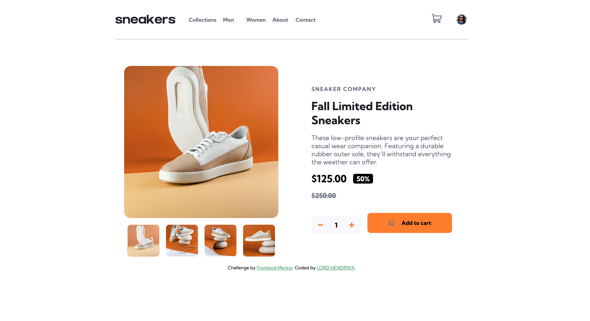

# Frontend Mentor - E-commerce product page solution

This is a solution to the [E-commerce product page challenge on Frontend Mentor](https://www.frontendmentor.io/challenges/ecommerce-product-page-UPsZ9MJp6). Frontend Mentor challenges help you improve your coding skills by building realistic projects.

## Table of contents

- [Overview](#overview)
  - [The challenge](#the-challenge)
  - [Screenshot](#screenshot)
  - [Links](#links)
- [My process](#my-process)
  - [Built with](#built-with)
  - [What I learned](#what-i-learned)
  - [Continued development](#continued-development)
  - [Useful resources](#useful-resources)
- [Author](#author)
- [Acknowledgments](#acknowledgments)

## Overview

### The challenge

Users should be able to:

- View the optimal layout for the site depending on their device's screen size
- See hover states for all interactive elements on the page
- Open a lightbox gallery by clicking on the large product image
- Switch the large product image by clicking on the small thumbnail images
- Add items to the cart
- View the cart and remove items from it

### Screenshot

### Links

- Solution URL: [Vercel](https://ecommerce-product-page-psi-seven.vercel.app/)
- Live Site URL: [Port 5501](http://127.0.0.1:5501/)

## My process

### Built with

- Semantic HTML5 markup
- CSS custom properties
- Flexbox
- CSS Grid
- Mobile-first workflow

### What I learned
I learnt how to implement different techniques like carousel and lightbox.

### Useful resources

- [Stack Overflow](https://www.stackoverflow.com)
- [w3 schools](https://www.w3schools.com) 

## Author
- Frontend Mentor - [Lord Hendrixx](https://www.frontendmentor.io/profile/beealmighty)
- Twitter - [Maduakonam Moses](https://www.twitter.com/Maduakonam67451)

## Acknowledgments

I would like to appreciate the entire developer community like stack overflow and w3 schools for their help and content.

